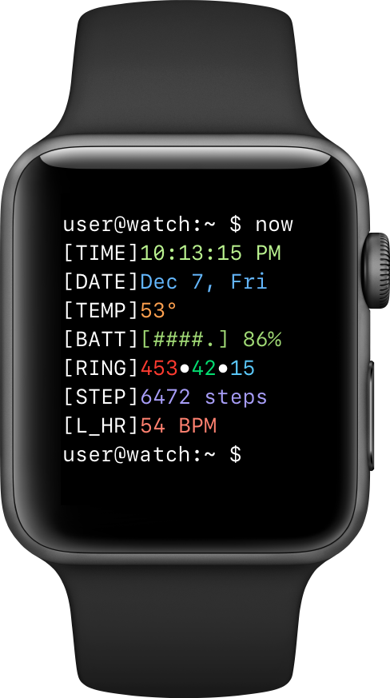

# TermiWatch

Terminal Watch Face for Apple Watch.

 

Copy from [this](https://github.com/kuglee/TermiWatch) post on GitHub u/kuglee.

For devices running watchOS 4 or higher.

# How to install

For installation go to kuglee's repo

## Installing the app
  1. Plug your phone into your computer.
  1. Unlock your phone and trust your computer.
  1. Select **XCode** menu -> **Product** -> **Destination**. At the **Device** section select your phone.
  1. Select **XCode** menu -> **Product** -> **Run**.
  1. Wait for the app to install on your phone.
  1. Go to **Settings** -> **General** -> **Profiles & Device Management** on your phone to trust the app.
  1. Install the watchOS app from the **Watch** app.
  1. Change your watch settings to Always show last used app.
